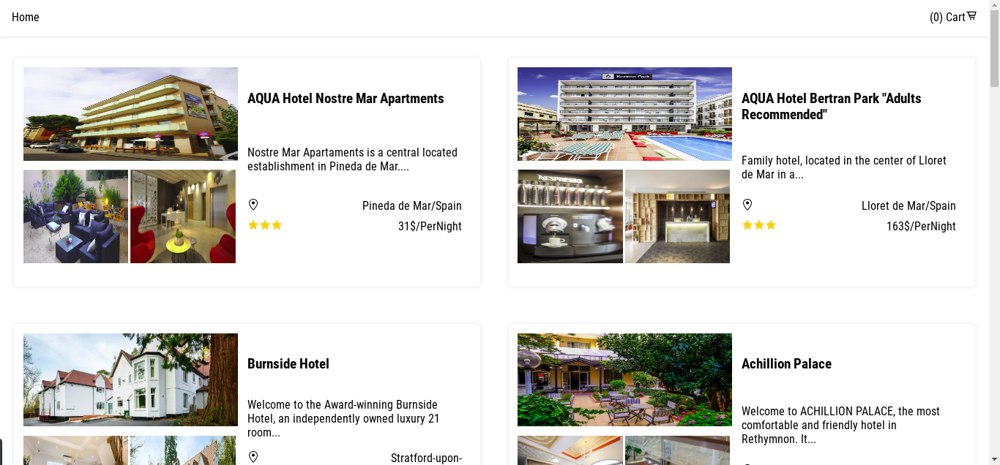
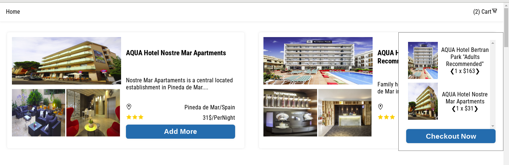
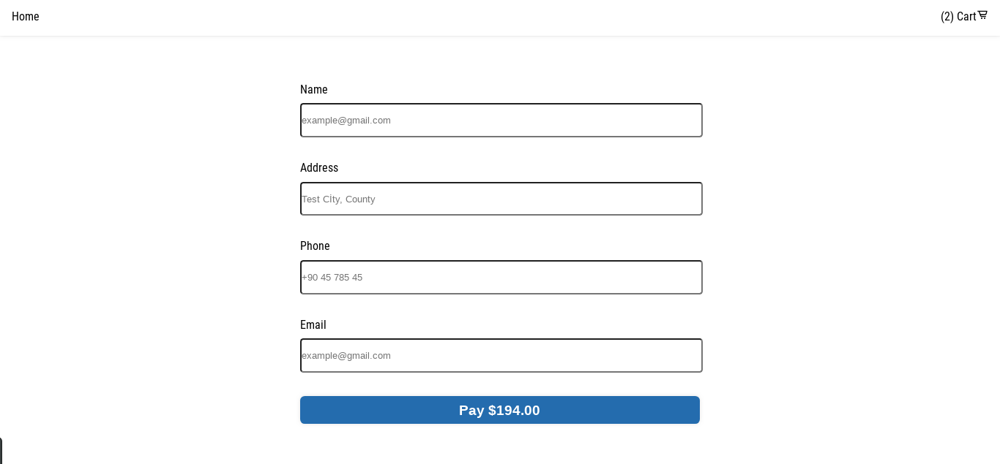

<h2  align="center">Hotel Checkout Application</h2>
<p>
  
 
 

</p>

<br>
<p style="display:flex;flex-direction:row;margin-bottom:50px">

</p>
<p style="display:flex;flex-direction:row;margin-bottom:50px">

</p>
<p style="display:flex;flex-direction:row;margin-bottom:50px">

</p>
<p style="display:flex;flex-direction:row;margin-bottom:50px">

</p>

<details open="open">
  <summary>Contents:</summary>
  <ol>
    <li>
      <a href="#about-the-project">About The Project</a>
      <ul>
       <li><a href="#stack-and-tools">Stack and Tools</a></li>
      </ul>
    </li>
    <li>
      <a href="#installation-instructions">Installation Instructions</a>
      <ul>
        <li><a href="#prerequisites">Prerequisites</a></li>
        <li><a href="#installation">Installation</a></li>
      </ul>
    </li>
    <li><a href="#current-routes">Current Routes</a></li>
      <li><a href="#deployment">Deployment</a></li>
    <li><a href="#contributing">Contributing</a></li>
    <li><a href="#licence">Licence</a></li>
    <li><a href="#author">Author</a></li>
  </ol>
</details>

## About the Project

### I wanted to see the state management with Context instead of Redux and decided to build this app. I coulnt find something fits my demands correctly. I was looking for something that uses Context and TypeScript and it must be very simple for someone who is looking at this code for learning the basics of checkout flows.So i created my own.Hope it helps those who needs some example about these.

## Stack and Tools:

- #### TypeScript
- #### React(Functional Components)
- #### Hooks
- #### HOCs
- #### Context
- #### Styled Components
- #### Responsive Design
- #### React Final Form
- #### Netlify
- #### Impala API

## Installation Instructions

### Prerequisites

You must have the Node.js and npm installed before this steps.For more[Node.js](https://nodejs.org/en/download/)

```sh
npm i npm@latest -g
```

### Installation

- Clone the Repo:

```

$ git clone git@github.com:rizikolik/HotelCheckout.git

$ cd hotelcheckout

```

- Install the app with the help of `package.json`:

```

$ npm install

```

- Start the server :

```

$ npm start


```

Now its ready at your configured port or at http://localhost:3000

## Current Routes

- #### / Home

- #### / checkout

- #### /payment

## Deployment

Deployed on Netlify [@netlify](https://hotelcheckout.netlify.app/)

## Contributing

Contributions, issues and feature requests are welcome!
Feel free to check issues page.

Fork it (https://github.com/rizikolik/HotelCheckout.git/fork) <br>
Create your working branch (git checkout -b [choose-a-name]) <br>
Commit your changes (git commit-m "commit") <br>
Push to the branch (git push origin [chosen-name]) <br>
Create a new Pull Request

## Author

👤 Yunus TURE

- Github: [@rizikolik](https://github.com/rizikolik)

## Licence

Distributed under the MIT License. See LICENSE for more information.
